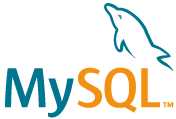

  

# MySQL Application

MySQL application is designed to interact with a MySQL database and perform actions on it. The application is built using the [Atlan Python Application SDK](https://github.com/atlanhq/application-sdk) and is intended to run on the Atlan Platform.

This application has two components:
- FastAPI server that exposes REST API to interact with the application.
- A workflow that runs on the Atlan platform that extracts metadata from a MySQL database, transforms it and pushes it to an object store.

## Table of contents
- [Getting Started](#getting-started)
- [Quick Start Guide](./docs/QUICK_START.md)
- [Features](#features)
- [Extending this application to other SQL sources](#extending-this-application-to-other-sql-sources)
- [Development](#development)
- [Architecture](./docs/ARCHITECTURE.md)

## Getting Started

https://github.com/user-attachments/assets/0ce63557-7c62-4491-96b9-1134a1ceadd6

## Features
1. Extract metadata from a MySQL database, transform and push to an object store
2. Supports Adhoc SQL queries on MySQL
3. OTel integration for metrics, traces and logs
4. _(In development)Supports mining query history from MySQL_
5. _(In development)Supports metadata(including tag) sync between Atlan and MySQL_
6. _(In development)Supports data profiling on MySQL_
7. _(In development)Supports data quality checks on MySQL_
8. _(In development)Supports data lineage on MySQL_

## Extending this application to other SQL sources
1. Make sure you add the required SQLAlchemy dialect using poetry. For ex. to add Snowflake dialect, `poetry add snowflake-sqlalchemy`
2. Update SQL queries in [`const.py`](app/const.py) file
3. Update the SQLAlchemy connection string generation in the [`workflow.py`](app/workflow.py) file
4. Run the application using the development guide
5. Update the tests in the [`tests`](tests) directory

## Development
- Setup the local development environment on [Mac](./docs/SETUP_MAC.md)
- [Development and Quickstart Guide](./docs/DEVELOPMENT.md)
- This application is just an SQL application implementation of Atlan's [Python Application SDK](https://github.com/atlanhq/application-sdk)
  - Please refer to the [examples](https://github.com/atlanhq/application-sdk/tree/main/examples) in the SDK to see how to use the SDK to build different applications on the Atlan Platform.
